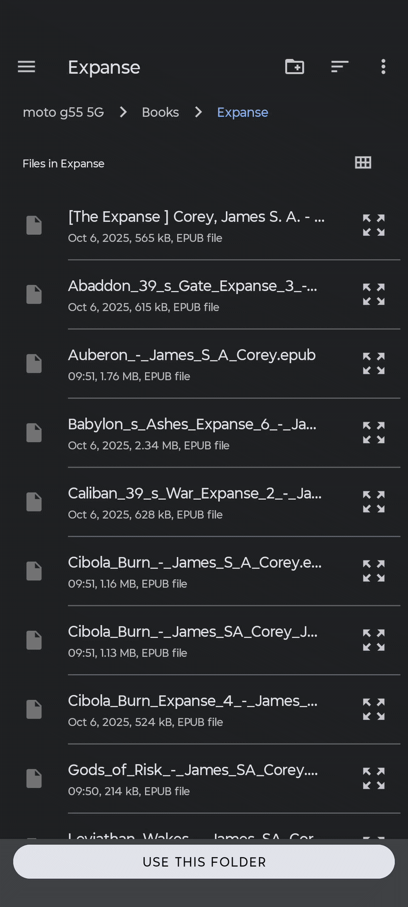

<a id="readme-top"></a>

<br />
<div align="center">
  

  <h3 align="center">EpubReader</h3>

  <p align="center">
    An offline-first mobile EPUB reader featuring dynamic theming, custom typography, and native file system integration.
  </p>

  <p align="center">
    <a href="https://github.com/your_username/EpubReader/releases/latest"></a>
  </p>
</div>

---

## Table of Contents

- [About The Project](#about-the-project)
  - [Key Features](#key-features)
  - [App Showcase & User Flow](#app-showcase--user-flow)
  - [Built With](#built-with)
- [Quick Install (Android)](#quick-install-android)
- [Getting Started](#getting-started)
  - [Prerequisites](#prerequisites)
  - [Installation](#installation)
- [Building for Production](#building-for-production)

## About The Project

EpubReader is a local mobile application that parses and displays `.epub` files directly from the device's storage It extracts book metadata, caches cover images, and renders e-book content through a responsive in-app web view, while letting readers customize their experience with dynamic dark mode and font selection.

### Key Features

- **Local library scanning** — automatically detects `.epub` files from the Files app on iOS, or a user-selected folder on Android via the Storage Access Framework
- **Dynamic theming** — full dark mode support across the entire app
- **Custom typography** — switch reading fonts on the fly
- **Metadata & cover caching** — titles, authors, and covers are parsed once and cached locally for fast subsequent loads
- **Fully offline** — browsing, opening, and reading books never requires a network connection
- **Native haptics** — tactile feedback throughout the UI

### App Showcase & User Flow

| Starting App & Folder Access | Reader & Delete | Settings |
| :---: | :---: | :---: |
|  |  |  |

### Built With

* [React Native](https://reactnative.dev/)
* [Expo](https://expo.dev/)
* [Expo Router](https://docs.expo.dev/router/introduction/)
* [Zustand](https://zustand-demo.pmnd.rs/)
* [TypeScript](https://www.typescriptlang.org/)
* [Epub.js](https://github.com/futurepress/epub.js/)

<p align="right">(<a href="#readme-top">back to top</a>)</p>

## Quick Install (Android)

If you don't want to build from source, grab the latest signed APK straight from the [**Releases**](https://github.com/your_username/EpubReader/releases) page, download it to your Android device, and install it directly — you may need to enable "Install unknown apps" for your browser or file manager the first time.

This is the fastest way to try EpubReader: no Node.js, no Expo account, no build step.

<p align="right">(<a href="#readme-top">back to top</a>)</p>

## Getting Started

To get a local copy up and running, follow these simple steps.

### Prerequisites

Ensure you have Node.js installed on your machine, then make sure npm is up to date:

```sh
npm install npm@latest -g
```

### Installation

1. Clone the repo

   ```sh
   git clone https://github.com/your_username/EpubReader.git
   cd EpubReader
   ```

2. Install NPM packages

   ```sh
   npm install
   ```

3. Start the dev server

   ```sh
   npm start
   ```

<p align="right">(<a href="#readme-top">back to top</a>)</p>

## Building for Production

This project uses [EAS Build](https://docs.expo.dev/build/introduction/) to compile standalone binaries. The `preview` profile in `eas.json` is configured to output a directly installable Android **APK** (rather than a Play Store `.aab` bundle), which is what you need for a fully offline installation outside the Play Store.

### One-time setup

```sh
npm install -g eas-cli
eas login
```

### Build the APK

```sh
eas build --platform android --profile preview
```

This queues a cloud build. Once it finishes, EAS prints a download link (and QR code) for the `.apk` file. Download it to an Android device and install it directly — you may need to enable "Install unknown apps" for your browser or file manager the first time.


<p align="right">(<a href="#readme-top">back to top</a>)</p>